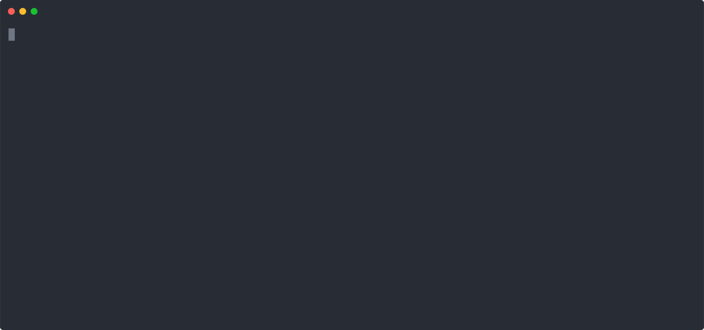

<!-- README.md is generated from README.Rmd. Please edit that file -->

```{r setup, include = FALSE}
knitr::opts_chunk$set(
  collapse = TRUE,
  comment = "#>",
  fig.path = "man/figures/",
  out.width = "100%")
```
# `ruODK`: An R Client for the ODK Central API 
<!-- badges: start -->
[](https://doi.org/10.5281/zenodo.3953158)
[](https://www.repostatus.org/#active)
[](https://github.com/ropensci/ruODK/commits/main)
[](https://github.com/ropensci/ruODK/issues/)
[](https://github.com/ropensci/ruODK/actions)
[](https://ci.appveyor.com/project/florianm/ruodk/branch/main)
[](https://codecov.io/gh/ropensci/ruODK)
[](https://www.codefactor.io/repository/github/ropensci/ruodk)
[](https://mybinder.org/v2/gh/dbca-wa/urODK/master?urlpath=rstudio)
<!-- badges: end -->

Especially in these trying times, it is important to ask "r u ODK?".

`ruODK` is an R client to access and parse data from ODK Central.

[OpenDataKit](https://getodk.org/) (ODK) is 
[free-and open-source software](https://getodk.org/software/) 
that helps millions of people collect data quickly, accurately, offline, 
and at scale. The software is in active use in every country in the world and is 
supported by a large and helpful community.

`ruODK` is a community contribution to the ODK ecosystem, but not directly 
affiliated with ODK.

`ruODK` assumes some familiarity of its users with the ODK ecosystem and workflows.
For a detailed overview, read the extensive [ODK documentation](https://docs.getodk.org/)
and visit the friendly [ODK forum](https://forum.getodk.org/).

[ODK Central](https://docs.getodk.org/central-intro/) is a cloud-based
data clearinghouse for digitally captured data, replacing the older software 
[ODK Aggregate](https://docs.getodk.org/aggregate-intro/). 
ODK Central manages user accounts and permissions, stores form definitions, 
and allows data collection clients like 
[ODK Collect](https://docs.getodk.org/collect-intro/) to connect to it for 
form download and submission upload.


A typical [ODK workflow](https://docs.getodk.org/#how-is-odk-used):
An XForm is designed e.g. in [ODK Build](https://build.getodk.org/),
[published to ODK Central](https://docs.getodk.org/central-forms/), 
and downloaded onto an Android device running ODK Collect.
After data have been captured digitally using 
[ODK Collect](https://docs.getodk.org/collect-intro/), the data are uploaded
and stored in ODK Central. The next step from there is to extract the data, 
optionally upload it into another data warehouse, and then to analyse and 
generate insight from it. 

While data can be retrieved in bulk through the GUI, ODK Central's API provides 
access to its data and functionality through both an OData and a RESTful API 
with a comprehensive and interactive 
[documentation](https://odkcentral.docs.apiary.io/#reference/odata-endpoints).

`ruODK` is aimed at the technically minded researcher who wishes to access and
process data from ODK Central using the programming language R.

Benefits of using the R ecosystem in combination with ODK:

*  Scalability: Both R and ODK are free and open source software. Scaling to
   many users does not incur license fees.
*  Ubiquity: R is known to many scientists and is widely taught at universities.
*  Automation: The entire data access and analysis workflow can be automated 
   through R scripts.
*  Reproducible reporting (e.g. 
   [Sweave](https://support.rstudio.com/hc/en-us/articles/200552056-Using-Sweave-and-knitr), 
   [RMarkdown](https://rmarkdown.rstudio.com/)), interactive web apps 
   ([Shiny](https://shiny.rstudio.com/)), 
   workflow scaling ([drake](https://docs.ropensci.org/drake/)).
* Rstudio-as-a-Service (RaaS) at 
  [](https://mybinder.org/v2/gh/dbca-wa/urODK/master?urlpath=rstudio)

`ruODK`'s scope:

*  To wrap all ODK Central API endpoints with a focus on **data access**.
*  To provide working examples of interacting with the ODK Central API.
*  To provide convenience helpers for the day to day tasks when working with 
   ODK Central data in R: **data munging** the ODK Central API output into tidy 
   R formats.
  
<!-- TODO: vignette "workflows" -->
`ruODK`'s use cases:

*  Smaller projects: Example [rOzCBI](https://dbca-wa.github.io/rOzCBI/)
   1. Data collection: ODK Collect
   2. Data clearinghouse: ODK Central
   3. Data analysis and reporting: `Rmd` (ruODK)
   4. Publishing and dissemination: [`ckanr`](https://docs.ropensci.org/ckanr/), 
      [`CKAN`](https://ckan.org/)
     
*  Larger projects:
   1. Data collection: ODK Collect
   2. Data clearinghouse: ODK Central
   3. ETL pipeline into data warehouses: `Rmd` (ruODK)
   4. QA: in data warehouse
   5. Reporting: `Rmd`
   6. Publishing and dissemination: [`ckanr`](https://docs.ropensci.org/ckanr/),
      [`CKAN`](https://ckan.org/)
      
  
Out of scope:

*  To wrap "management" API endpoints. ODK Central is a
   [VueJS/NodeJS application](https://github.com/opendatakit/central-frontend/) 
   which provides a comprehensive graphical user interface for the management of 
   users, roles, permissions, projects, and forms.
*  To provide extensive data visualisation. We show only minimal examples of data 
   visualisation and presentation, mainly to illustrate the example data.
   Once the data is in your hands as tidy tibbles... urODK!

## A quick preview


## Install

You can install the development version (`main` branch) of `ruODK` with:

```{r gh-installation, eval = FALSE}
if (!requireNamespace("remotes")) install.packages("remotes")
remotes::install_github("ropensci/ruODK@main", dependencies = TRUE)
```

## ODK Central
### Access to an ODK Central instance
First, we need an ODK Central instance and some data to play with!

Either [request a free trial](https://getodk.org/#odk-cloud)
or follow the [setup instructions](https://docs.getodk.org/central-intro/)
to build and deploy your very own ODK Central instance.

### ODK Central setup
The ODK Central [user manual](https://docs.getodk.org/central-using/) 
provides up-to-date descriptions of the steps below.

*  [Create a web user account](https://docs.getodk.org/central-users/#creating-a-web-user) 
   on an ODK Central instance. Your username will be an email address.
*  [Create a project](https://docs.getodk.org/central-projects/) and give 
   the web user at least
   [read permissions](https://docs.getodk.org/central-projects/#managing-project-managers).
*  Create an XForm, e.g. using ODK Build, or use the 
   [example forms](https://github.com/ropensci/ruODK/tree/master/inst/extdata) 
   provided by `ruODK`. The `.odkbuild` versions can be loaded into 
   [ODK Build](https://build.getodk.org/), while the `.xml` versions can be 
   directly imported into ODK Central.
*  [Publish the form](https://docs.getodk.org/central-forms/)
   to ODK Central.
*  Collect some data for this form on ODK Collect and let ODK Collect submit the
   finalised forms to ODK Central.

## Configure `ruODK`
Set up `ruODK` with an OData Service URL and credentials of a read-permitted
ODK Central web user. Adjust verbosity to your liking.
  
```{r ru_setup_rmd, echo=FALSE, eval=TRUE}
ruODK::ru_setup(
  svc = Sys.getenv("ODKC_TEST_SVC"),
  un = Sys.getenv("ODKC_TEST_UN"),
  pw = Sys.getenv("ODKC_TEST_PW"),
  tz = "Australia/Perth",
  verbose = TRUE
)
```

```{r ru_setup_demo, echo=TRUE, eval=FALSE}
ruODK::ru_setup(
  svc = "https://my.odkcentral.getodk.org/v1/projects/14/forms/myform.svc",
  un = "me@email.com",
  pw = "...",
  tz = "Australia/Perth",
  verbose = TRUE # great for demo or debugging
)
```

For all available detailed options to configure `ruODK`, read 
[`vignette("setup", package = "ruODK")`](https://docs.ropensci.org/ruODK/articles/setup.html).

## Use ruODK

A quick example browsing projects, forms, submissions, and accessing the data:

```{r odata_example, eval=T, message=TRUE}
library(ruODK)
# Part 1: Data discovery ------------------------------------------------------#
# List projects
proj <- ruODK::project_list()
proj %>% head() %>% knitr::kable(.)
# List forms of default project
frms <- ruODK::form_list()
frms %>% head() %>% knitr::kable(.)
# Form details of default form
frmd <- ruODK::form_detail()
frmd %>% knitr::kable(.)
# Form schema: defaults to version 1.1
meta <- ruODK::form_schema(odkc_version = get_test_odkc_version())
meta %>% knitr::kable(.)
# Part 2: Data access ---------------------------------------------------------#
# Form tables
srv <- ruODK::odata_service_get()
srv %>% knitr::kable(.)
# Form submissions
data <- ruODK::odata_submission_get(local_dir = fs::path("vignettes/media"),
                                    odkc_version = get_test_odkc_version())
data %>% dplyr::select(-"odata_context") %>% knitr::kable(.)
```

A more detailed walk-through with some data visualisation examples is available
in the [`vignette("odata-api", package="ruODK")`](https://docs.ropensci.org/ruODK/articles/odata-api.html).

See also [`vignette("restful-api", package="ruODK")`](https://docs.ropensci.org/ruODK/articles/restful-api.html)
for examples using the alternative RESTful API.

## Try ruODK
[](https://mybinder.org/v2/gh/dbca-wa/urODK/master?urlpath=rstudio) 
will launch a disposable, hosted RStudio instance with `ruODK` installed and
the companion package [`urODK`](https://github.com/dbca-wa/urODK) opened as 
starting point for a hands-on workshop or instant demo of `ruODK` usage. 

Create a new RMarkdown workbook from `ruODK` template "ODK Central via OData" 
and follow the instructions within.

## Contribute
Contributions through [issues](https://github.com/ropensci/ruODK/issues) and PRs 
are welcome!

See the [contributing guide](https://docs.ropensci.org/ruODK/CONTRIBUTING.html)
on best practices and further readings for code contributions.

## Attribution
`ruODK` was developed, and is maintained, by Florian Mayer for the Western Australian 
[Department of Biodiversity, Conservation and Attractions (DBCA)](https://www.dbca.wa.gov.au/).
The development was funded both by DBCA core funding and external funds from
the [North West Shelf Flatback Turtle Conservation Program](https://flatbacks.dbca.wa.gov.au/).

To cite package `ruODK` in publications use:

```{r citation}
citation("ruODK")
```

## Acknowledgements
The Department of Biodiversity, Conservation and Attractions (DBCA) acknowledges 
the traditional owners of country throughout Western Australia and their continuing 
connection to the land, waters and community. We pay our respects to them, their 
culture and to their Elders past and present.

This software was created both as a contribution to the ODK ecosystem and for 
the conservation of the biodiversity of Western Australia, and in doing so, 
caring for country.

## Package functionality
See [`vignette("comparison", package="ruODK")`](https://docs.ropensci.org/ruODK/articles/comparison.html)
for a comprehensive comparison of ruODK to other software packages from
both an ODK and an OData angle.
