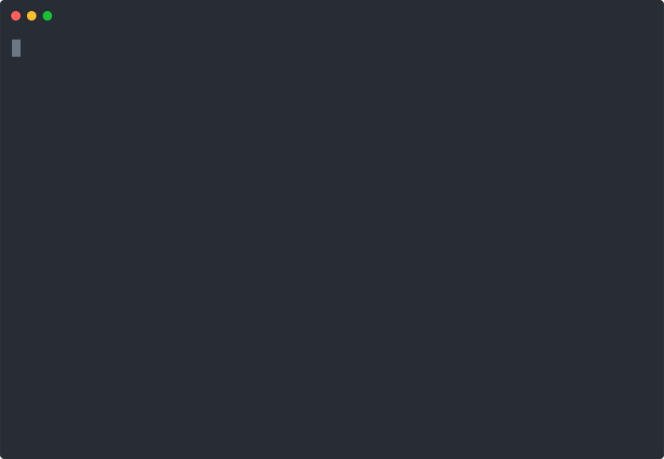

<!-- README.md is generated from README.Rmd. Please edit that file -->

# `ruODK`: An R Client for the ODK Central API 

<!-- badges: start -->

[](https://github.com/ropensci/software-review/issues/335)
[](https://www.repostatus.org/#active)
[](https://github.com/dbca-wa/ruODK/commits/master)
[](https://github.com/dbca-wa/ruODK/issues/)
[](https://github.com/dbca-wa/ruODK/actions)
[](https://codecov.io/github/dbca-wa/ruODK?branch=master)
[](https://mybinder.org/v2/gh/dbca-wa/urODK/master?urlpath=rstudio)
<!-- badges: end -->

`ruODK` is an R client to access and parse data from ODK Central.

[OpenDataKit](https://getodk.org/) (ODK) is [free-and open-source
software](https://getodk.org/software/) that helps millions of people
collect data quickly, accurately, offline, and at scale. The software is
in active use in every country in the world and is supported by a large
and helpful community.

`ruODK` assumes some familiarity of its users with the ODK ecosystem and
workflows. For a detailed overview, read the extensive [ODK
documentation](https://docs.getodk.org/) and visit the friendly [ODK
forum](https://forum.getodk.org/).

[ODK Central](https://docs.getodk.org/central-intro/) is a cloud-based
data clearinghouse for digitally captured data, replacing the older
software [ODK Aggregate](https://docs.getodk.org/aggregate-intro/). ODK
Central manages user accounts and permissions, stores form definitions,
and allows data collection clients like [ODK
Collect](https://docs.getodk.org/collect-intro/) to connect to it for
form download and submission upload.


A typical [ODK workflow](https://docs.getodk.org/#how-is-odk-used): An
XForm is designed e.g. in [ODK Build](https://build.getodk.org//),
[published to ODK Central](https://docs.getodk.org/central-forms/), and
downloaded onto an Android device running ODK Collect. After data have
been captured digitally using [ODK
Collect](https://docs.getodk.org/collect-intro/), the data are uploaded
and stored in ODK Central. The next step from there is to extract the
data, optionally upload it into another data warehouse, and then to
analyse and generate insight from it.

While data can be retrieved in bulk through the GUI, ODK Central’s API
provides access to its data and functionality through both an OData and
a RESTful API with a comprehensive and interactive
[documentation](https://odkcentral.docs.apiary.io/#reference/odata-endpoints).

`ruODK` is aimed at the technically minded researcher who wishes to
access and process data from ODK Central using the programming language
R.

Benefits of using the R ecosystem in combination with ODK:

  - Scalability: Both R and ODK are free and open source software.
    Scaling to many users does not incur license fees.
  - Ubiquity: R is known to many scientists and is widely taught at
    universities.
  - Automation: The entire data access and analysis workflow can be
    automated through R scripts.
  - Reproducible reporting (e.g. 
    [Sweave](https://support.rstudio.com/hc/en-us/articles/200552056-Using-Sweave-and-knitr),
    [RMarkdown](https://rmarkdown.rstudio.com/)), interactive web apps
    ([Shiny](https://shiny.rstudio.com/)), workflow scaling
    ([drake](https://docs.ropensci.org/drake/)).
  - Rstudio-as-a-Service (RaaS) at
    [](https://mybinder.org/v2/gh/dbca-wa/urODK/master?urlpath=rstudio)

`ruODK`’s scope:

  - To wrap all ODK Central API endpoints with a focus on **data
    access**.
  - To provide working examples of interacting with the ODK Central API.
  - To provide convenience helpers for the day to day tasks when working
    with ODK Central data in R: **data munging** the ODK Central API
    output into tidy R formats.

`ruODK`’s use cases:

  - Smaller projects: Example
    [rOzCBI](https://dbca-wa.github.io/rOzCBI/)
    1.  Data collection: ODK Collect
    2.  Data clearinghouse: ODK Central
    3.  Data analysis and reporting: `Rmd` (ruODK)
    4.  Publishing and dissemination:
        [`ckanr`](https://docs.ropensci.org/ckanr/),
        [`CKAN`](https://ckan.org/)
  - Larger projects:
    1.  Data collection: ODK Collect
    2.  Data clearinghouse: ODK Central
    3.  ETL pipeline into data warehouses: `Rmd` (ruODK)
    4.  QA: in data warehouse
    5.  Reporting: `Rmd`
    6.  Publishing and dissemination:
        [`ckanr`](https://docs.ropensci.org/ckanr/),
        [`CKAN`](https://ckan.org/)

Out of scope:

  - To wrap “management” API endpoints. ODK Central is a [VueJS/NodeJS
    application](https://github.com/opendatakit/central-frontend/) which
    provides a comprehensive graphical user interface for the management
    of users, roles, permissions, projects, and forms.
  - To provide extensive data visualisation. We show only minimal
    examples of data visualisation and presentation, mainly to
    illustrate the example data. Once the data is in your hands as tidy
    tibbles… urODK\!

## A quick preview



## Install

You can install `ruODK` from GitHub with:

``` r
if (!requireNamespace("remotes")) {install.packages("remotes")}
remotes::install_github("dbca-wa/ruODK", dependencies = TRUE)
```

## ODK Central

### Access to an ODK Central instance

First, we need an ODK Central instance and some data to play with\!

Either ask in the [ODK forum](https://forum.getodk.org/) for an account
in the [ODK Central Sandbox](https://sandbox.central.getodk.org/), or
follow the [setup instructions](https://docs.getodk.org/central-intro/)
to build and deploy your very own ODK Central instance.

### ODK Central setup

The ODK Central [user manual](https://docs.getodk.org/central-using/)
provides up-to-date descriptions of the steps below.

  - [Create a web user
    account](https://docs.getodk.org/central-users/#creating-a-web-user)
    on an ODK Central instance. Your username will be an email address.
  - [Create a project](https://docs.getodk.org/central-projects/) and
    give the web user at least [read
    permissions](https://docs.getodk.org/central-projects/#managing-project-managers).
  - Create an XForm, e.g. using ODK Build, or use the [example
    forms](https://github.com/dbca-wa/ruODK/tree/master/inst/extdata)
    provided by `ruODK`. The `.odkbuild` versions can be loaded into
    [ODK Build](https://build.getodk.org/), while the `.xml` versions
    can be directly imported into ODK Central.
  - [Publish the form](https://docs.getodk.org/central-forms/) to ODK
    Central.
  - Collect some data for this form on ODK Collect and let ODK Collect
    submit the finalised forms to ODK Central.

## Configure `ruODK`

Set up `ruODK` with an OData Service URL and credentials of a
read-permitted ODK Central web user. Adjust verbosity to your liking.

    #> <ruODK settings>
    #>   Default ODK Central Project ID:  14 
    #>   Default ODK Central Form ID:  build_Flora-Quadrat-0-4_1564384341 
    #>   Default ODK Central URL:  https://sandbox.central.getodk.org 
    #>   Default ODK Central Username:  Florian.Mayer@dbca.wa.gov.au 
    #>   Default ODK Central Password: run ruODK::get_default_pw() to show 
    #>   Default Time Zone:  Australia/Perth 
    #>   Default ODK Central Version:  0.8 
    #>   Test ODK Central Project ID: 14 
    #>   Test ODK Central Form ID: build_Flora-Quadrat-0-4_1564384341 
    #>   Test ODK Central Form ID (ZIP tests): build_Spotlighting-0-6_1558333698 
    #>   Test ODK Central Form ID (Attachment tests): build_Flora-Quadrat-0-1_1558330379 
    #>   Test ODK Central Form ID (Parsing tests): build_Turtle-Track-or-Nest-1-0_1569907666 
    #>   Test ODK Central URL: https://sandbox.central.getodk.org 
    #>   Test ODK Central Username: Florian.Mayer@dbca.wa.gov.au 
    #>   Test ODK Central Password: run ruODK::get_test_pw() to show 
    #>   Test ODK Central Version:  
    #>   Verbose messages: TRUE

``` r
ruODK::ru_setup(
  svc = "https://sandbox.central.getodk.org/v1/projects/14/forms/build_Flora-Quadrat-0-4_1564384341.svc",
  un = "me@email.com",
  pw = "...",
  tz = "Australia/Perth",
  verbose = TRUE # great for demo or debugging
)
```

For all available detailed options to configure `ruODK`, read
[`vignette("setup", package =
"ruODK")`](https://dbca-wa.github.io/ruODK/articles/setup.html).

## Use ruODK

A quick example browsing projects, forms, submissions, and accessing the
data:

``` r
library(ruODK)
# Part 1: Data discovery ------------------------------------------------------#
# List projects
proj <- ruODK::project_list()
proj %>% head() %>% knitr::kable(.)
```

| id | name                     | forms | app\_users | created\_at         | updated\_at | last\_submission    | archived |
| -: | :----------------------- | ----: | ---------: | :------------------ | :---------- | :------------------ | :------- |
| 59 | 1Horizon test project    |     1 |          3 | 2020-01-13 20:45:32 | NA          | 2020-01-23 22:20:13 | FALSE    |
| 57 | AB’s                     |     1 |          1 | 2020-01-06 08:56:00 | NA          | NA                  | FALSE    |
|  8 | AmenazasRD               |     1 |          1 | 2019-04-14 14:21:00 | NA          | 2020-04-21 14:23:06 | FALSE    |
|  9 | BAFCO Test               |     1 |          1 | 2019-04-19 08:30:45 | NA          | 2019-04-19 09:26:49 | FALSE    |
| 79 | Birhan Project           |     1 |          1 | 2020-05-11 20:58:06 | NA          | 2020-05-12 00:09:16 | FALSE    |
| 47 | Building Materials Reuse |     0 |          0 | 2019-10-16 13:07:56 | NA          | NA                  | FALSE    |

``` r
# List forms of default project
frms <- ruODK::form_list()
frms %>% knitr::kable(.)
```

| name                          | fid                                              | version | state   | submissions | created\_at         | created\_by\_id | created\_by                    | updated\_at         | last\_submission    | hash                             |
| :---------------------------- | :----------------------------------------------- | :------ | :------ | :---------- | :------------------ | --------------: | :----------------------------- | :------------------ | :------------------ | :------------------------------- |
| Flora Quadrat 0.1             | build\_Flora-Quadrat-0-1\_1558330379             |         | closing | 1           | 2019-05-20 13:33:15 |              57 | <florian.mayer@dbca.wa.gov.au> | 2019-05-23 09:46:39 | 2019-05-20 13:44:20 | 4f0036619468ef05b572631b04b94f06 |
| Flora Quadrat 0.2             | build\_Flora-Quadrat-0-2\_1558575936             |         | open    | 2           | 2019-05-23 09:46:08 |              57 | <florian.mayer@dbca.wa.gov.au> | 2019-08-19 15:57:38 | 2019-05-23 11:12:16 | 14e269a2374132392c275117efbe67b6 |
| Flora Quadrat 0.3             | build\_Flora-Quadrat-0-3\_1559119570             |         | open    | 1           | 2019-05-29 16:48:15 |              57 | <florian.mayer@dbca.wa.gov.au> | NA                  | 2019-05-29 16:55:59 | d5a80cefb1895eefcd0cb86a12d8acb4 |
| Flora Quadrat 0.4             | build\_Flora-Quadrat-0-4\_1564384341             |         | open    | 2           | 2019-08-19 15:58:28 |              57 | <florian.mayer@dbca.wa.gov.au> | NA                  | 2019-09-18 16:51:07 | 1bb959d541ac6990e3f74893e38c855b |
| Spotlighting 0.5              | build\_Spotlighting-0-5\_1558320001              |         | closing | 1           | 2019-05-20 10:44:47 |              57 | <florian.mayer@dbca.wa.gov.au> | 2019-05-20 14:30:41 | 2019-05-20 10:58:09 | 3775dcdface98ba3a426739c494123f6 |
| Spotlighting 0.6              | build\_Spotlighting-0-6\_1558333698              |         | open    | 18          | 2019-05-20 14:30:21 |              57 | <florian.mayer@dbca.wa.gov.au> | NA                  | 2019-10-09 09:15:23 | 456daaa9a4f96670e6eef3cf4a7dd0db |
| Spotlighting Survey End 0.3   | build\_Spotlighting-Survey-End-0-3\_1558320208   |         | open    | 3           | 2019-05-20 10:44:38 |              57 | <florian.mayer@dbca.wa.gov.au> | NA                  | 2019-10-09 10:43:40 | 5fdfac8e773834b1267f7ca7e1c9a428 |
| Spotlighting Survey Start 0.3 | build\_Spotlighting-Survey-Start-0-3\_1558320795 |         | open    | 9           | 2019-05-20 10:53:50 |              57 | <florian.mayer@dbca.wa.gov.au> | NA                  | 2019-10-09 09:15:25 | f548a064cca13bca746f3c0b1a8b5a32 |
| Turtle Track or Nest 1.0      | build\_Turtle-Track-or-Nest-1-0\_1569907666      |         | open    | 2           | 2019-12-03 15:16:51 |              57 | <florian.mayer@dbca.wa.gov.au> | NA                  | 2019-12-03 15:26:14 | 0b3b5e07e3f24f3a36afc92296693ec4 |

``` r
# Form details of default form
frmd <- ruODK::form_detail()
frmd %>% knitr::kable(.)
```

| name              | fid                                  | version | state | submissions | created\_at              | created\_by\_id | created\_by                    | updated\_at | last\_submission         | hash                             |
| :---------------- | :----------------------------------- | :------ | :---- | ----------: | :----------------------- | --------------: | :----------------------------- | :---------- | :----------------------- | :------------------------------- |
| Flora Quadrat 0.4 | build\_Flora-Quadrat-0-4\_1564384341 |         | open  |           2 | 2019-08-19T07:58:28.211Z |              57 | <florian.mayer@dbca.wa.gov.au> | NA          | 2019-09-18T08:51:07.481Z | 1bb959d541ac6990e3f74893e38c855b |

``` r
# Form schema
meta <- ruODK::form_schema()
#> ℹ form schema v0.8
meta %>% knitr::kable(.)
```

| name                                  | type      | path                                                       | ruodk\_name                                                |
| :------------------------------------ | :-------- | :--------------------------------------------------------- | :--------------------------------------------------------- |
| meta                                  | structure | /meta                                                      | meta                                                       |
| instanceID                            | string    | /meta/instanceID                                           | meta\_instanceID                                           |
| encounter\_start\_datetime            | dateTime  | /encounter\_start\_datetime                                | encounter\_start\_datetime                                 |
| reporter                              | string    | /reporter                                                  | reporter                                                   |
| device\_id                            | string    | /device\_id                                                | device\_id                                                 |
| location                              | structure | /location                                                  | location                                                   |
| area\_name                            | string    | /location/area\_name                                       | location\_area\_name                                       |
| quadrat\_photo                        | binary    | /location/quadrat\_photo                                   | location\_quadrat\_photo                                   |
| corner1                               | geopoint  | /location/corner1                                          | location\_corner1                                          |
| habitat                               | structure | /habitat                                                   | habitat                                                    |
| morphological\_type                   | select1   | /habitat/morphological\_type                               | habitat\_morphological\_type                               |
| morphological\_type\_photo            | binary    | /habitat/morphological\_type\_photo                        | habitat\_morphological\_type\_photo                        |
| vegetation\_stratum                   | repeat    | /vegetation\_stratum                                       | vegetation\_stratum                                        |
| nvis\_level3\_broad\_floristic\_group | select1   | /vegetation\_stratum/nvis\_level3\_broad\_floristic\_group | vegetation\_stratum\_nvis\_level3\_broad\_floristic\_group |
| max\_height\_m                        | decimal   | /vegetation\_stratum/max\_height\_m                        | vegetation\_stratum\_max\_height\_m                        |
| foliage\_cover                        | select1   | /vegetation\_stratum/foliage\_cover                        | vegetation\_stratum\_foliage\_cover                        |
| dominant\_species\_1                  | string    | /vegetation\_stratum/dominant\_species\_1                  | vegetation\_stratum\_dominant\_species\_1                  |
| dominant\_species\_2                  | string    | /vegetation\_stratum/dominant\_species\_2                  | vegetation\_stratum\_dominant\_species\_2                  |
| dominant\_species\_3                  | string    | /vegetation\_stratum/dominant\_species\_3                  | vegetation\_stratum\_dominant\_species\_3                  |
| dominant\_species\_4                  | string    | /vegetation\_stratum/dominant\_species\_4                  | vegetation\_stratum\_dominant\_species\_4                  |
| perimeter                             | structure | /perimeter                                                 | perimeter                                                  |
| corner2                               | geopoint  | /perimeter/corner2                                         | perimeter\_corner2                                         |
| corner3                               | geopoint  | /perimeter/corner3                                         | perimeter\_corner3                                         |
| corner4                               | geopoint  | /perimeter/corner4                                         | perimeter\_corner4                                         |
| mudmap\_photo                         | binary    | /perimeter/mudmap\_photo                                   | perimeter\_mudmap\_photo                                   |
| taxon\_encounter                      | repeat    | /taxon\_encounter                                          | taxon\_encounter                                           |
| field\_name                           | string    | /taxon\_encounter/field\_name                              | taxon\_encounter\_field\_name                              |
| photo\_in\_situ                       | binary    | /taxon\_encounter/photo\_in\_situ                          | taxon\_encounter\_photo\_in\_situ                          |
| taxon\_encounter\_location            | geopoint  | /taxon\_encounter/taxon\_encounter\_location               | taxon\_encounter\_taxon\_encounter\_location               |
| life\_form                            | select1   | /taxon\_encounter/life\_form                               | taxon\_encounter\_life\_form                               |
| voucher\_specimen\_barcode            | barcode   | /taxon\_encounter/voucher\_specimen\_barcode               | taxon\_encounter\_voucher\_specimen\_barcode               |
| voucher\_specimen\_label              | string    | /taxon\_encounter/voucher\_specimen\_label                 | taxon\_encounter\_voucher\_specimen\_label                 |
| encounter\_end\_datetime              | dateTime  | /encounter\_end\_datetime                                  | encounter\_end\_datetime                                   |

``` r
# Part 2: Data access ---------------------------------------------------------#
# Form tables
srv <- ruODK::odata_service_get()
srv %>% knitr::kable(.)
```

| name                            | kind      | url                             |
| :------------------------------ | :-------- | :------------------------------ |
| Submissions                     | EntitySet | Submissions                     |
| Submissions.vegetation\_stratum | EntitySet | Submissions.vegetation\_stratum |
| Submissions.taxon\_encounter    | EntitySet | Submissions.taxon\_encounter    |

``` r
# Form submissions
data <- ruODK::odata_submission_get(local_dir = fs::path("vignettes/media"))
#> ℹ Downloading submissions...
#> ✔ Downloaded submissions.
#> ℹ Parsing submissions...
#> ℹ Reading form schema...
#> ℹ form schema v0.8
#> ℹ Parsing submissions...
#> New names:
#> * `@odata.context` -> .odata.context
#> ℹ Unnesting column "value"
#> ℹ Found more nested columns, unnesting again.
#> ℹ Unnesting column "value___system"
#> ℹ Unnesting column "value_meta"
#> ℹ Unnesting column "value_location"
#> ℹ Unnesting column "value_habitat"
#> ℹ Unnesting column "value_perimeter"
#> ℹ Found more nested columns, unnesting again.
#> ℹ Unnesting column "value_location_corner1"
#> ℹ Unnesting column "value_perimeter_corner2"
#> ℹ Unnesting column "value_perimeter_corner3"
#> ℹ Unnesting column "value_perimeter_corner4"
#> ℹ Found more nested columns, unnesting again.
#> ℹ Unnesting column "value_location_corner1_coordinates"
#> ℹ Unnesting column "value_location_corner1_properties"
#> ℹ Unnesting column "value_perimeter_corner2_coordinates"
#> ℹ Unnesting column "value_perimeter_corner2_properties"
#> ℹ Unnesting column "value_perimeter_corner3_coordinates"
#> ℹ Unnesting column "value_perimeter_corner3_properties"
#> ℹ Unnesting column "value_perimeter_corner4_coordinates"
#> ℹ Unnesting column "value_perimeter_corner4_properties"
#> ℹ Found date/times: encounter_start_datetime, encounter_end_datetime.
#> ℹ Found attachments: location_quadrat_photo, habitat_morphological_type_photo, perimeter_mudmap_photo.
#> ℹ Downloading attachments...
#> ℹ Using local directory "vignettes/media".
#> ◉ File already downloaded, keeping "vignettes/media/1568794395624.jpg".
#> ◉ File already downloaded, keeping "vignettes/media/1568786958640.jpg".
#> ℹ Using local directory "vignettes/media".
#> ◉ File already downloaded, keeping "vignettes/media/1568794560256.jpg".
#> ◉ File already downloaded, keeping "vignettes/media/1568787004467.jpg".
#> ℹ Using local directory "vignettes/media".
#> ◯ Filename is NA, skipping download.
#> ◉ File already downloaded, keeping "vignettes/media/1568787172983.jpg".
#> ✔ Returning parsed submissions.
data %>% knitr::kable(.)
```

| id                                        | encounter\_start\_datetime | reporter      | device\_id       | encounter\_end\_datetime | system\_submission\_date | system\_submitter\_id | system\_submitter\_name | system\_attachments\_present | system\_attachments\_expected | meta\_instance\_id                        | location\_area\_name     | location\_quadrat\_photo          | location\_corner1\_type | location\_corner1\_coordinates\_15 | location\_corner1\_coordinates\_16 | location\_corner1\_coordinates\_17 | location\_corner1\_properties\_accuracy | habitat\_morphological\_type | habitat\_morphological\_type\_photo | vegetation\_stratum\_odata\_navigation\_link                                 | perimeter\_corner2\_type | perimeter\_corner2\_coordinates\_23 | perimeter\_corner2\_coordinates\_24 | perimeter\_corner2\_coordinates\_25 | perimeter\_corner2\_properties\_accuracy | perimeter\_corner3\_type | perimeter\_corner3\_coordinates\_28 | perimeter\_corner3\_coordinates\_29 | perimeter\_corner3\_coordinates\_30 | perimeter\_corner3\_properties\_accuracy | perimeter\_corner4\_type | perimeter\_corner4\_coordinates\_33 | perimeter\_corner4\_coordinates\_34 | perimeter\_corner4\_coordinates\_35 | perimeter\_corner4\_properties\_accuracy | perimeter\_mudmap\_photo          | taxon\_encounter\_odata\_navigation\_link                                 | odata\_context                                                                                                         |
| :---------------------------------------- | :------------------------- | :------------ | :--------------- | :----------------------- | :----------------------- | :-------------------- | :---------------------- | ---------------------------: | ----------------------------: | :---------------------------------------- | :----------------------- | :-------------------------------- | :---------------------- | ---------------------------------: | ---------------------------------: | ---------------------------------: | --------------------------------------: | :--------------------------- | :---------------------------------- | :--------------------------------------------------------------------------- | :----------------------- | ----------------------------------: | ----------------------------------: | ----------------------------------: | ---------------------------------------: | :----------------------- | ----------------------------------: | ----------------------------------: | ----------------------------------: | ---------------------------------------: | :----------------------- | ----------------------------------: | ----------------------------------: | ----------------------------------: | ---------------------------------------: | :-------------------------------- | :------------------------------------------------------------------------ | :--------------------------------------------------------------------------------------------------------------------- |
| uuid:d5e78a78-34db-483d-978f-d9c9a3bc7b69 | 2019-09-18 16:12:21        | Florian Mayer | f73d2e1221ceaa06 | 2019-09-18 16:40:46      | 2019-09-18T08:51:07.481Z | 241                   | flora                   |                            4 |                             4 | uuid:d5e78a78-34db-483d-978f-d9c9a3bc7b69 | Kensington Carpark 01    | vignettes/media/1568794395624.jpg | Point                   |                           115.8846 |                         \-31.99606 |                            6.40451 |                                   4.288 | mid-slope                    | vignettes/media/1568794560256.jpg   | Submissions(‘uuid:d5e78a78-34db-483d-978f-d9c9a3bc7b69’)/vegetation\_stratum | Point                    |                            115.8844 |                          \-31.99623 |                         \-26.305695 |                                    4.288 | Point                    |                            115.8844 |                          \-31.99615 |                         \-17.897552 |                                    4.288 | Point                    |                            115.8843 |                          \-31.99610 |                         \-27.759338 |                                    4.288 | NA                                | Submissions(‘uuid:d5e78a78-34db-483d-978f-d9c9a3bc7b69’)/taxon\_encounter | <https://sandbox.central.getodk.org/v1/projects/14/forms/build_Flora-Quadrat-0-4_1564384341.svc/$metadata#Submissions> |
| uuid:529cb189-8bb2-4cf1-9041-dcde716efb4f | 2019-09-18 14:08:43        | Florian Mayer | f73d2e1221ceaa06 | 2019-09-18 14:18:53      | 2019-09-18T06:20:25.780Z | 241                   | flora                   |                            8 |                             8 | uuid:529cb189-8bb2-4cf1-9041-dcde716efb4f | Kensington Planter Box 1 | vignettes/media/1568786958640.jpg | Point                   |                           115.8843 |                         \-31.99615 |                         \-17.37241 |                                   4.288 | flat                         | vignettes/media/1568787004467.jpg   | Submissions(‘uuid:529cb189-8bb2-4cf1-9041-dcde716efb4f’)/vegetation\_stratum | Point                    |                            115.8844 |                          \-31.99620 |                          \-8.662476 |                                    4.288 | Point                    |                            115.8844 |                          \-31.99622 |                          \-6.266144 |                                    4.288 | Point                    |                            115.8844 |                          \-31.99621 |                          \-6.597748 |                                    4.288 | vignettes/media/1568787172983.jpg | Submissions(‘uuid:529cb189-8bb2-4cf1-9041-dcde716efb4f’)/taxon\_encounter | <https://sandbox.central.getodk.org/v1/projects/14/forms/build_Flora-Quadrat-0-4_1564384341.svc/$metadata#Submissions> |

A more detailed walk-through with some data visualisation examples is
available in the [`vignette("odata-api",
package="ruODK")`](https://dbca-wa.github.io/ruODK/articles/odata.html).

See also [`vignette("restful-api",
package="ruODK")`](https://dbca-wa.github.io/ruODK/articles/api.html)
for examples using the alternative RESTful API.

## Try ruODK

[](https://mybinder.org/v2/gh/dbca-wa/urODK/master?urlpath=rstudio)
will launch a disposable, hosted RStudio instance with `ruODK` installed
and the companion package [`urODK`](https://github.com/dbca-wa/urODK)
opened as starting point for a hands-on workshop or instant demo of
`ruODK` usage.

Create a new RMarkdown workbook from `ruODK` template “ODK Central via
OData” and follow the instructions within.

## Contribute

Contributions through [issues](https://github.com/dbca-wa/ruODK/issues)
and PRs are welcome\!

See the [contributing
guide](https://dbca-wa.github.io/ruODK/CONTRIBUTING.html) on best
practices and further readings for code contributions.

## Attribution

`ruODK` was developed, and is maintained, by Florian Mayer for the
Western Australian [Department of Biodiversity, Conservation and
Attractions (DBCA)](https://www.dbca.wa.gov.au/). The development was
funded both by DBCA core funding and external funds from the [North West
Shelf Flatback Turtle Conservation
Program](https://flatbacks.dbca.wa.gov.au/).

To cite package `ruODK` in publications use:

``` r
citation("ruODK")
#> 
#> To cite ruODK in publications use:
#> 
#>   Florian W. Mayer (2019). ruODK: Client for the ODK Central API. R
#>   package version 0.6.6. https://github.com/dbca-wa/ruODK
#> 
#> A BibTeX entry for LaTeX users is
#> 
#>   @Misc{,
#>     title = {ruODK: Client for the ODK Central API},
#>     author = {Florian W. Mayer},
#>     note = {R package version 0.6.6},
#>     year = {2019},
#>     url = {https://github.com/dbca-wa/ruODK},
#>   }
```

## Acknowledgements

The Department of Biodiversity, Conservation and Attractions (DBCA)
acknowledges the traditional owners of country throughout Western
Australia and their continuing connection to the land, waters and
community. We pay our respects to them, their culture and to their
Elders past and present.

This software was created both as a contribution to the ODK ecosystem
and for the conservation of the biodiversity of Western Australia, and
in doing so, caring for country.

## Package functionality

There are several other R packages interacting with the ODK ecosystem,
and/or [OData](https://www.odata.org/).

### Comparison of ODK related software packages (non-ODK core)

| Package                         | [`ruODK`](https://dbca-wa.github.io/ruODK/)                                                                                                                                                                                                                                                                      | [`odkr`](https://validmeasures.org/odkr/)                                                                                                                                                                                                            | [`odk`](https://cran.r-project.org/package=odk)                                                                     | [`odkmeta`](https://github.com/nap2000/odkmeta)                                                                                        | [`koboloadeR`](https://unhcr.github.io/koboloadeR/docs/index.html)                                                                                                                                                                                                                                                                                                                                                                   | [Pentaho Kettle tutorial](https://github.com/schemetrica/automating-data-delivery-odk-central)                                                                                                           |
| ------------------------------- | ---------------------------------------------------------------------------------------------------------------------------------------------------------------------------------------------------------------------------------------------------------------------------------------------------------------- | ---------------------------------------------------------------------------------------------------------------------------------------------------------------------------------------------------------------------------------------------------- | ------------------------------------------------------------------------------------------------------------------- | -------------------------------------------------------------------------------------------------------------------------------------- | ------------------------------------------------------------------------------------------------------------------------------------------------------------------------------------------------------------------------------------------------------------------------------------------------------------------------------------------------------------------------------------------------------------------------------------ | -------------------------------------------------------------------------------------------------------------------------------------------------------------------------------------------------------- |
| Elevator pitch                  | “[ckanr](https://github.com/ropensci/ckanr) for ODK Central”                                                                                                                                                                                                                                                     | “Drive ODK Briefcase through R”                                                                                                                                                                                                                      | “Export ODK Aggregate to SPSS”                                                                                      | “Export ODK Aggregate to STATA”                                                                                                        | “Metapackage for the extended ODK ecosystem”                                                                                                                                                                                                                                                                                                                                                                                         | “What ruODK does, but as GUI”                                                                                                                                                                            |
| Last commit                     | [](https://github.com/dbca-wa/ruODK/commits/master)                                                                                                                                                                               | [](https://github.com/validmeasures/odkr/commits/master)                                                                                                         | Nov 2017                                                                                                            | [](https://github.com/nap2000/odkmeta/commits/master) | [](https://github.com/unhcr/koboloadeR/commits/master)                                                                                                                                                                                                                                                                                             | [](https://github.com/schemetrica/automating-data-delivery-odk-central/commits/master) |
| Website                         | [](https://github.com/dbca-wa/ruODK) [](https://dbca-wa.github.io/ruODK/)                                                                 | [](https://github.com/validmeasures/odkr) [](https://validmeasures.org/odkr/) | [](https://rdrr.io/cran/odk/) | [](https://github.com/nap2000/odkmeta)                | [](https://github.com/unhcr/koboloadeR) [](https://unhcr.github.io/koboloadeR/docs/index.html)                                                                                                                                                                | [](https://github.com/schemetrica/automating-data-delivery-odk-central)                                                 |
| Test coverage                   | [](https://github.com/dbca-wa/ruODK/actions) [](https://codecov.io/github/dbca-wa/ruODK?branch=master) | [](https://codecov.io/gh/validmeasures/odkr)                                                                                                                       | ❌                                                                                                                   | In repo                                                                                                                                | [](https://travis-ci.org/unhcr/koboloadeR) [](https://ci.appveyor.com/project/unhcr/koboloadeR) [](https://codecov.io/gh/unhcr/koboloadeR) | NA                                                                                                                                                                                                       |
| Working examples                | README, 3 vignettes, pkgdown, Rmd templates                                                                                                                                                                                                                                                                      | README, pkgdown                                                                                                                                                                                                                                      | CRAN PDF                                                                                                            | README                                                                                                                                 | README, 9 vignettes, shiny apps, pkgdown                                                                                                                                                                                                                                                                                                                                                                                             | Tutorial with screenshots                                                                                                                                                                                |
| Available on CRAN               | [](https://cran.r-project.org/package=ruODK)                                                                                                                                                                                                           | [](https://cran.r-project.org/package=odkr)                                                                                                                                                 | [](https://CRAN.R-project.org/package=odk)                       | NA                                                                                                                                     | [](https://cran.r-project.org/package=koboloadeR)                                                                                                                                                                                                                                                                                                                     | NA                                                                                                                                                                                                       |
| Technologies                    | Tidyverse R, XForms                                                                                                                                                                                                                                                                                              | Base R                                                                                                                                                                                                                                               | Base R                                                                                                              | Stata                                                                                                                                  | R metapackage, XlsForms                                                                                                                                                                                                                                                                                                                                                                                                              | Pentaho Kettle GUI                                                                                                                                                                                       |
| External dependencies           | None                                                                                                                                                                                                                                                                                                             | Java, ODK Briefcase                                                                                                                                                                                                                                  | SPSS                                                                                                                | Stata                                                                                                                                  | Java, ODK Briefcase, wraps `odkr`                                                                                                                                                                                                                                                                                                                                                                                                    | [Pentaho Kettle](http://www.ibridge.be/), Java                                                                                                                                                           |
| Affiliation                     | [DBCA WA](https://www.dbca.wa.gov.au/science) / [ROpenSci prospectus](https://github.com/ropensci/software-review/issues/335)                                                                                                                                                                                    | [Valid Measues](https://github.com/validmeasures)                                                                                                                                                                                                    | [Muntashir-Al-Arefin](https://stackoverflow.com/users/8875690/muntashir-al-arefin)                                  | [ODK Central developer Matt White](https://github.com/matthew-white)                                                                   | [UNHCR](https://github.com/unhcr)                                                                                                                                                                                                                                                                                                                                                                                                    | [Schemetrica](https://github.com/schemetrica)                                                                                                                                                            |
| Covers ODK Central OData API    | ✅                                                                                                                                                                                                                                                                                                                | ❌                                                                                                                                                                                                                                                    | ❌                                                                                                                   | ❌                                                                                                                                      | ❌                                                                                                                                                                                                                                                                                                                                                                                                                                    | ✅                                                                                                                                                                                                        |
| Covers ODK Central REST API     | ✅                                                                                                                                                                                                                                                                                                                | ❌                                                                                                                                                                                                                                                    | ❌                                                                                                                   | ❌                                                                                                                                      | ❌                                                                                                                                                                                                                                                                                                                                                                                                                                    | ❌                                                                                                                                                                                                        |
| Covers ODK Central bulk export  | ✅                                                                                                                                                                                                                                                                                                                | ❌                                                                                                                                                                                                                                                    | ❌                                                                                                                   | ✅                                                                                                                                      | ❌                                                                                                                                                                                                                                                                                                                                                                                                                                    | ✅                                                                                                                                                                                                        |
| Covers ODK Central OpenRosa API | ❌ no need, gets all data through OData/REST API                                                                                                                                                                                                                                                                  | ✅ via ODK Briefcase                                                                                                                                                                                                                                  | ❌                                                                                                                   | ❌                                                                                                                                      | ✅ via ODK Briefcase                                                                                                                                                                                                                                                                                                                                                                                                                  | ✅                                                                                                                                                                                                        |
| Data post-processing            | ✅                                                                                                                                                                                                                                                                                                                | ✅                                                                                                                                                                                                                                                    | ❌                                                                                                                   | ✅                                                                                                                                      | ✅                                                                                                                                                                                                                                                                                                                                                                                                                                    | ✅                                                                                                                                                                                                        |
| Data visualisation examples     | ✅                                                                                                                                                                                                                                                                                                                | ❌                                                                                                                                                                                                                                                    | ❌                                                                                                                   | ❌                                                                                                                                      | ✅                                                                                                                                                                                                                                                                                                                                                                                                                                    | ❌                                                                                                                                                                                                        |

In summary:

`ruODK` provides a dependency-free interface to ODK Central.

`koboloadeR` is a metapackage containing lots of ancillary packages,
with some heavy dependencies on Java and ODK Briefcase (which in turn
can access ODK Central). Although built around the XlsForm standard and
paradigm, `koboloadeR` is well worth exploring as a larger context to
data wrangling in the ODK ecosystem.

Schemetrica’s tutorial illustrates data ETL from ODK Central and
deserves a special mention, as it is both very recent and aimed
specifically against ODK Central. The GUI paradigm of Pentaho Kettle
addresses a different audience to the scripting paradigm of `ruODK`. It
should be mentioned that Kettle’s composable data manipulation steps can
be used for many other use cases apart from ODK Central.

### Comparison of OData related R packages

| Package                                         | [`ruODK`](https://dbca-wa.github.io/ruODK/)                                                                                                                                                                                                                                                                      | [`odataR`](https://github.com/HanOostdijk/odataR)                                                                                            | [`cbsodataR`](https://github.com/edwindj/cbsodataR)                                                                                                                                                                                                                                                                                                                                          | [`OData`](https://cran.r-project.org/web/packages/OData/index.html)                                                                   | [OData JDBC R tutorial](https://www.cdata.com/kb/tech/odata-jdbc-r.rst)                                                               |
| ----------------------------------------------- | ---------------------------------------------------------------------------------------------------------------------------------------------------------------------------------------------------------------------------------------------------------------------------------------------------------------- | -------------------------------------------------------------------------------------------------------------------------------------------- | -------------------------------------------------------------------------------------------------------------------------------------------------------------------------------------------------------------------------------------------------------------------------------------------------------------------------------------------------------------------------------------------- | ------------------------------------------------------------------------------------------------------------------------------------- | ------------------------------------------------------------------------------------------------------------------------------------- |
| Elevator pitch                                  | “[ckanr](https://github.com/ropensci/ckanr) for ODK Central”                                                                                                                                                                                                                                                     | “OData client for <https://opendata.cbs.nl> (and similar)”                                                                                   | “OData client for <https://www.cbs.nl>”                                                                                                                                                                                                                                                                                                                                                      | “Minimal OData example”                                                                                                               | “Minimal RJDBC example”                                                                                                               |
| Last commit                                     | [](https://github.com/dbca-wa/ruODK/commits/master)                                                                                                                                                                               | [](https://github.com/HanOostdijk/odataR/commits/master) | [](https://github.com/edwindj/cbsodataR/commits/master)                                                                                                                                                                                                                                                   | Dec 2016                                                                                                                              | ❓                                                                                                                                     |
| Website                                         | [](https://github.com/dbca-wa/ruODK) [](https://dbca-wa.github.io/ruODK/)                                                                 | [](https://github.com/HanOostdijk/odataR)                   | [](https://cran.r-project.org/web/packages/cbsodataR/) [](https://github.com/edwindj/cbsodataR) [](https://edwindj.github.io/cbsodataR/) | [](https://cran.r-project.org/web/packages/OData/index.html) | [](https://www.cdata.com/kb/tech/odata-jdbc-r.rst) |
| Test coverage                                   | [](https://github.com/dbca-wa/ruODK/actions) [](https://codecov.io/github/dbca-wa/ruODK?branch=master) | ❌                                                                                                                                            | [](https://travis-ci.org/edwindj/cbsodataR) [](https://ci.appveyor.com/project/edwindj/cbsodatar)                                                                                            | ❌                                                                                                                                     | ❌                                                                                                                                     |
| Targets ODK Central                             | ✅                                                                                                                                                                                                                                                                                                                | ❌                                                                                                                                            | ❌                                                                                                                                                                                                                                                                                                                                                                                            | ❌                                                                                                                                     | ❌                                                                                                                                     |
| Works with ODK Central                          | ✅                                                                                                                                                                                                                                                                                                                | ❓                                                                                                                                            | ❓                                                                                                                                                                                                                                                                                                                                                                                            | ❌                                                                                                                                     | ❌                                                                                                                                     |
| Data wrangling helpers for post-processing      | ✅                                                                                                                                                                                                                                                                                                                | some                                                                                                                                         | some                                                                                                                                                                                                                                                                                                                                                                                         | ❌                                                                                                                                     | ❌                                                                                                                                     |
| Actively maintained to work against ODK Central | ✅                                                                                                                                                                                                                                                                                                                | ❌                                                                                                                                            | ❌                                                                                                                                                                                                                                                                                                                                                                                            | ❌                                                                                                                                     | ❌                                                                                                                                     |
| Technologies                                    | R, httr, xml2, tidyr, purrr                                                                                                                                                                                                                                                                                      | R, jsonlite, tidyverse                                                                                                                       | R, tidyverse                                                                                                                                                                                                                                                                                                                                                                                 | R, XML, RJSONIO                                                                                                                       | R, RJDBC, Java                                                                                                                        |
| External dependencies                           | ✅ None                                                                                                                                                                                                                                                                                                           | ✅ None                                                                                                                                       | ✅ None                                                                                                                                                                                                                                                                                                                                                                                       | ✅ None                                                                                                                                | ❌ JDBC, Java                                                                                                                          |
| Available on CRAN                               | [](https://cran.r-project.org/package=ruODK)                                                                                                                                                                                                           | [](https://cran.r-project.org/package=odataR)                                     | [](https://CRAN.R-project.org/package=cbsodataR)                                                                                                                                                                                                                                                                                    | [](https://CRAN.R-project.org/package=OData)                                     | NA                                                                                                                                    |

In summary:

`ruODK` is the only R package explicitly aimed at ODK Central’s OData
and RESTful API, as well as providing context and helpers around
specific recurring data wrangling tasks.

The value of OData lies in its self-descriptive nature, which allows
tools to introspect the data structures and types. Both GUI-driven tools
like MS PowerBI and `ruODK` use this introspection to assist users in
wrangling their own data.

The script-based approach of `ruODK` allows to automate the data
extraction, transformation, and reporting pipeline, and therefore
provide reproducible reporting.
